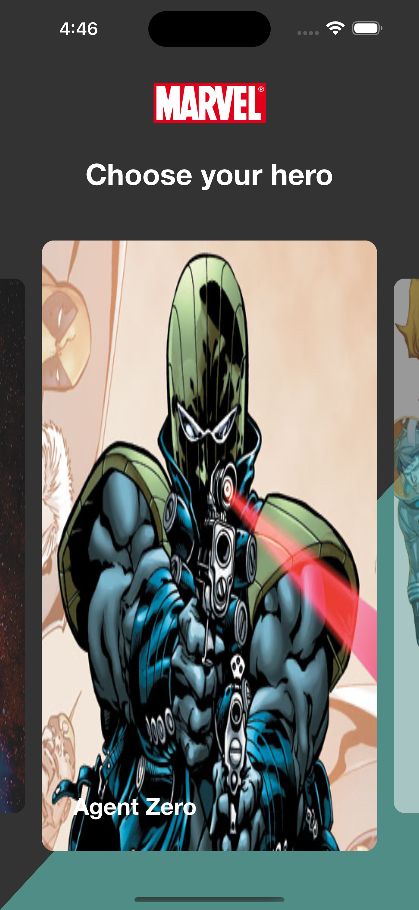

# MarvelApp

## Why i created this app
This is my first project on the IOS platform. On it, I learned the basics of mobile development as part of my internship at Effective.

## Topics
* Navigation
* MVVM
* AutoLayout
* Theming
* Localizition
* Animation transitions
* Image caching

## Screenshots

### Main screen

|                     Loading                     |                      Display                       |
|:-----------------------------------------------:|:--------------------------------------------------:|
|  |  |

### Details screen

|                    Datails Screen                    |
|:-------------------------------------------------:|
|  |

### Theming

|                      Dark                       |                      Light                      |
|:-----------------------------------------------:|:-----------------------------------------------:|
|  |  |

### Portrait and Landscape

|                    Portrait                     |                   Landscape                    |
|:-----------------------------------------------:|:----------------------------------------------:|
|  |  |

### Localization

|                        Ru                        |                      Eng                       |
|:------------------------------------------------:|:----------------------------------------------:|
|  |  |

## Used dependencies
* AutoLayout - [SnapKit](https://github.com/SnapKit/SnapKit)
* Animation scrolling ColectionView - [AnimatedCollectionViewLayout](https://github.com/KelvinJin/AnimatedCollectionViewLayout)
* DataBase - [RealmSwift](https://github.com/realm/realm-swift)
* Network - [Alamofire](https://github.com/Alamofire/Alamofire)
* Network image - [Kingfisher](https://github.com/onevcat/Kingfisher)

## How to run
* Download the project and run MarvelApp.xcworkspace with Xcode
* Change the `publicKey` and p`privateKey` for the API in `MarvelApp/Models/Service/HeroService`
* Run simulator
* Enjoy!

## My contact
Valery Shestakov, medicmtt@gmail.com
